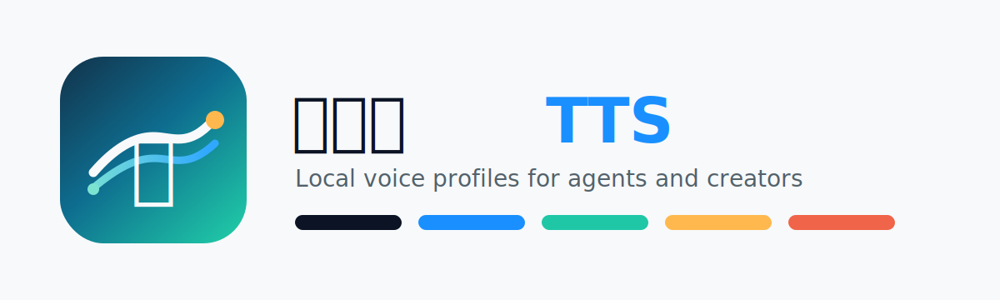

# 逍遥族TTS

本地优先的声音克隆工具，面向创作者和 Agent 工作流。

当前阶段：CLI MVP 已可用，Web UI 将作为独立项目面开发。



## What It Does

- 把 `.m4a/.mp3/.wav` 参考录音保存为可复用声音档案
- 自动转成 `16kHz mono WAV`
- 自动 ASR 或手动维护参考文稿
- 用 VoxCPM2 极致克隆生成配音
- 支持单条、批量、生成历史和 agent-friendly JSON

## Quick Start

```bash
python -m venv .venv
source .venv/bin/activate
pip install -e ".[all]"

xiaoyao-tts doctor
```

创建声音档案：

```bash
xiaoyao-tts profile create \
  --name me \
  --audio ./me.m4a
```

如果你已经有参考音频文稿，可以跳过自动识别：

```bash
xiaoyao-tts profile create \
  --name me \
  --audio ./me.m4a \
  --transcript "这是一段参考录音的文字内容。"
```

生成配音：

```bash
xiaoyao-tts speak \
  --profile me \
  --text "大家好，今天我们来分享一个主题。" \
  --out ./out.wav
```

给 Agent 调用时加 `--json`：

```bash
xiaoyao-tts profile list --json
xiaoyao-tts speak --profile me --text-file script.txt --out out.wav --json
```

修正参考音频文稿：

```bash
xiaoyao-tts profile update-transcript me \
  --transcript-file corrected-transcript.txt
```

查看生成历史：

```bash
xiaoyao-tts history list
xiaoyao-tts history list --profile me --json
```

批量生成：

```bash
# txt: 一行一条文案，空行和 # 注释会跳过
xiaoyao-tts batch \
  --profile me \
  --input scripts.txt \
  --out-dir outputs/batch

# jsonl: 每行一个 {"id": "...", "text": "..."}
xiaoyao-tts batch \
  --profile me \
  --input scripts.jsonl \
  --out-dir outputs/batch \
  --json
```

## Project Structure

```text
xiaoyaozu-tts/
  assets/brand/   Logo 与品牌资产
  docs/           产品和设计文档
  examples/       批量输入示例
  src/            CLI 与核心代码
  tests/          基础测试
```

## Docs

- [Installation](docs/installation.md)
- [CLI Reference](docs/cli.md)
- [Agent Usage](docs/agent.md)
- [Safety And Consent](docs/safety.md)
- [Roadmap](docs/roadmap.md)

## Brand Assets

- `assets/brand/xiaoyaozu-tts-logo.svg`
- `assets/brand/xiaoyaozu-tts-mark.svg`
- `docs/brand.md`

## Local Data

默认数据目录：

```text
~/.xiaoyaozu-tts/
  profiles/
  outputs/
  history/generations.jsonl
```

可以通过环境变量覆盖：

```bash
export XIAOYAO_TTS_HOME=/path/to/local/data
```
